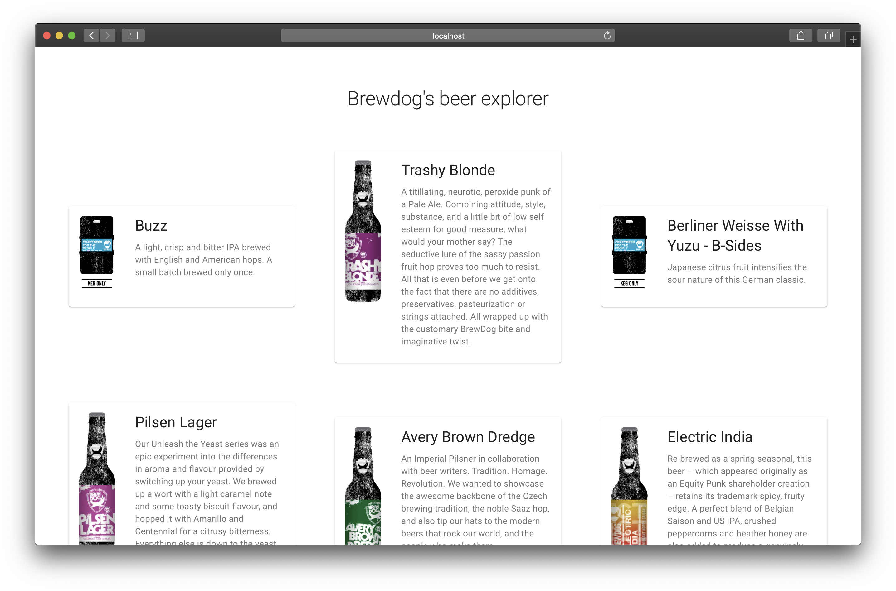

# Server Side Rendering Example

A simple example of how to work with the React & Redux Toolkit with server-side rendering.

<p align="center">
  
</p>

The main goal of this application was to implement SSR on the React vanilla features, without frameworks like Gatsby, Next.js and ets.

## Installation

```bash
# Install deps
yarn

# Run dev build
yarn dev

# Or Run production build
yarn start
```
